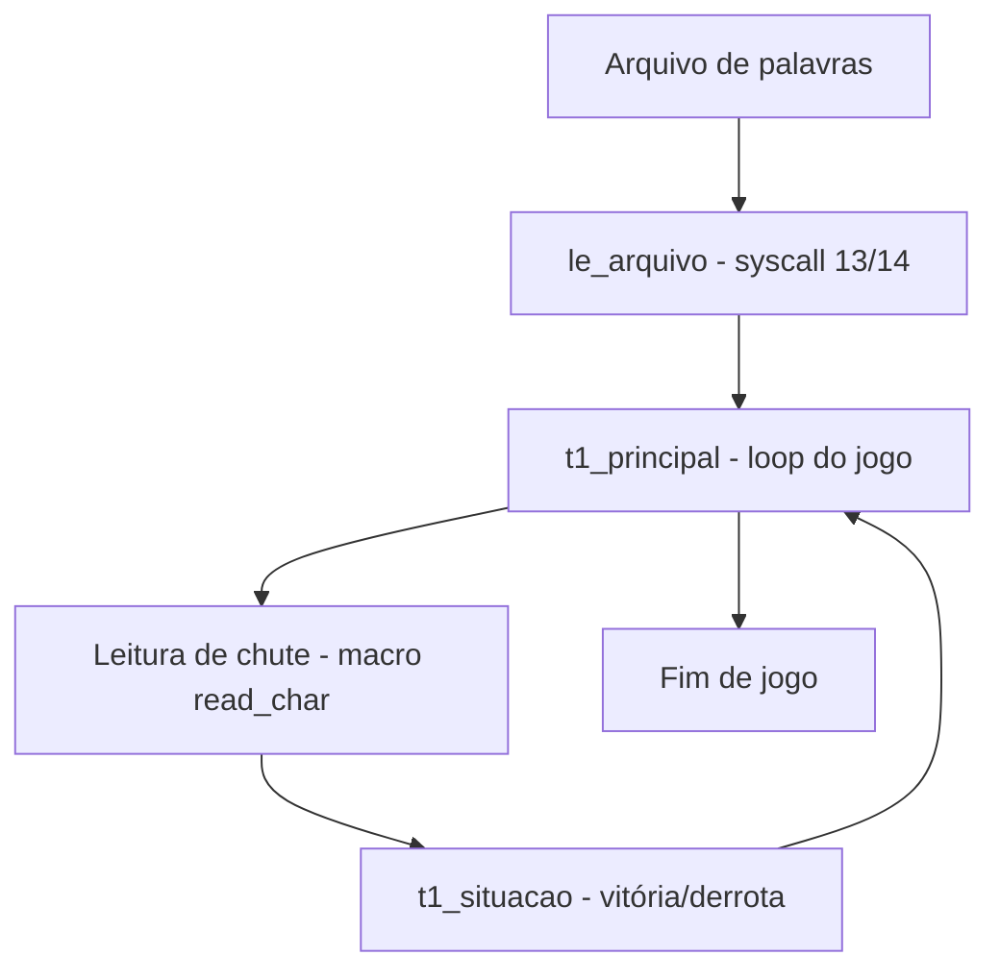

# 🎯 Forca-em-Assembly
<p align="center">
  
  <a href="https://github.com/panda12332145/Forca-em-assembly/commits/main"></a>
  <a href="https://github.com/panda12332145/Forca-em-assembly"></a>
  
</p>
---
## 🔖 Resumo

Jogo da **forca** implementado em **linguagem Assembly** (arquitetura com syscalls no estilo MIPS/SPIM), dividido em 4 módulos: leitura de palavras de arquivo, lógica principal do jogo, verificação de situação (vitória/derrota) e utilitários. Projeto acadêmico de programação em baixo nível.

### ✨ Funcionalidades Principais

- ✅ 4 módulos Assembly separados (arquivo, principal, situação, util)
- ✅ Leitura de dicionário de palavras via syscall de arquivo
- ✅ Estado do jogo (forca) gerenciado em memória
- ✅ Macros para leitura de caractere e saída

## 📽 Demonstração

```text
$ spim t1_principal.asm
Palavra: _ _ _ _ _
Chute: a
Forca:   |
  -----+
...
```

## ⚙️ Explicação das Partes Importantes

### Leitura de arquivo (`t1_larquivo.asm`)

```asm
# le o texto de um arquivo e armazena em um buffer
.globl le_arquivo
le_arquivo:
    la $a0, arquivo
    li $v0, 13        # syscall open
    syscall
    move $t0, $v0
    li $v0, 14        # syscall read
    syscall
```

> Usa as syscalls 13/14 para carregar o dicionário de palavras na memória.

### Principal e macros (`t1_principal.asm`)

```asm
.macro read_char()
    li $v0, 12        # syscall le caractere
    syscall
.end_macro
```

> Macros encapsulam entradas/saídas; o principal orquestra o loop do jogo.

### Situação e utilitários

```asm
# t1_situacao.asm — verifica vitoria/derrota
# t1_util.asm     — rotinas auxiliares de impressao
```

> Separações de responsabilidades — prática de organização de código em Assembly.

## 🔄 Fluxo de Trabalho / Arquitetura



## 📂 Estrutura do Projeto

```plaintext
Forca-em-assembly/
├── README.md
└── jogo_forca-master/
    ├── t1_principal.asm   # Loop principal + macros
    ├── t1_larquivo.asm    # Leitura de palavras do arquivo
    ├── t1_situacao.asm    # Vitória/derrota
    └── t1_util.asm        # Utilitários
```

## 🛠️ Tecnologias

| Ferramenta | Uso |
|---|---|
| **Assembly** | Linguagem (syscalls estilo MIPS/SPIM) |
| **SPIM/MARS** | Simulador sugerido para execução |

## ▶️ Instalação

```bash
git clone https://github.com/panda12332145/Forca-em-assembly.git
cd Forca-em-assembly
# instale um simulador (SPIM ou MARS) para a arquitetura-alvo
```

## 🚀 Execução

```bash
spim jogo_forca-master/t1_principal.asm
# ou abra os arquivos no MARS (GUI)
```

## ⚠️ Limitações

- Depende de simulador específico
- Arquivo de palavras precisa existir no caminho esperado
- Código acadêmico inicial (sem tratar todos os erros)

## 🚀 Roadmap

- [ ] Tela de jogo completa com desenho da forca
- [ ] Dicionário embutido
- [ ] Port para x86 (NASM)

## 📄 Licença

Todos os direitos reservados ao autor.

---

## 👾 Autor

<p align="center">
  
</p>

<p align="center">Feito por <strong>Panda12332145</strong> 👋🏽</p>

---

## 🧑‍💻 Sobre Mim

Sou apaixonado por **Física Teórica, Cibersegurança e Desenvolvimento de Sistemas**. Tenho grande interesse em programação de baixo nível, engenharia reversa, automação, sistemas Windows, criptografia e segurança ofensiva. Também gosto bastante de música, filosofia e computação avançada.

---

## 🌐 Redes

* **Site:** [https://panda-h0me.netlify.app/](https://panda-h0me.netlify.app/)
* **YouTube:** [https://www.youtube.com/@X86BinaryGhost](https://www.youtube.com/@X86BinaryGhost)
* **Instagram:** [https://www.instagram.com/01pandal10/](https://www.instagram.com/01pandal10/)
* **GitHub:** [https://github.com/panda12332145](https://github.com/panda12332145)
* **LinkedIn:** [linkedin.com/in/athos-da-boanergis](https://www.linkedin.com/in/athos-d%C3%A3-boanergis-5585a4288/)

---

## 🚀 Áreas de Interesse

* **Cibersegurança Avançada** 🔒
* **Hacking & Engenharia Reversa** 💻
* **Computação de Baixo Nível** 🖥️
* **Matemática e Física Teórica** 📐⚛️
* **Desenvolvimento de Ferramentas de Segurança** 🛠️

_"Conhecimento é poder, e domínio técnico vem da compreensão profunda dos sistemas."_

---

## 📞 Contato & Suporte

Para colaborações, dúvidas ou sugestões:

📧 **E-mail:** [athos.cybersec@gmail.com](mailto:athos.cybersec@gmail.com)

🐛 **Reportar Bug:** [Abrir Issue](https://github.com/panda12332145/Forca-em-assembly/issues)

💡 **Sugerir Melhoria:** [Discussions](https://github.com/panda12332145/Forca-em-assembly/discussions)
